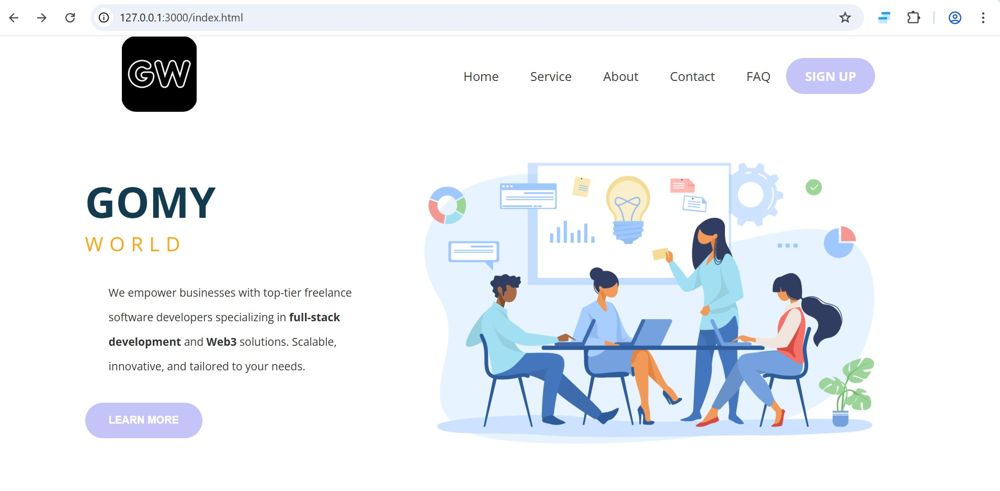

# GOMY World - Modern Business Landing Page



## 🚀 Project Overview

GOMY World is a sleek, responsive landing page for a tech services company, built with modern CSS techniques. This project showcases:

- **Flexbox-powered layout** for perfect alignment and responsiveness
- **Mobile-first approach** with media queries
- **Professional design** with attention to typography and spacing
- **Interactive elements** with smooth hover effects

## ✨ Key Features

### 🧩 Flexbox Mastery

This project demonstrates advanced Flexbox implementation:

- **Header navigation**: Perfectly spaced and aligned using `justify-content: space-around`
- **Main content layout**: Responsive two-column design that stacks on mobile
- **Navigation menu**: Centered vertically with `align-items: center`
- **Mobile adaptation**: Flex direction changes to column for smaller screens

### 🎨 Design Highlights

- Clean, modern color scheme with accent colors
- Responsive typography using Open Sans font
- Interactive hover effects on navigation links
- Attention to accessibility with focus states
- Pixel-perfect spacing and alignment

## 🛠️ Technologies Used

- **HTML5** semantic structure
- **CSS3 Flexbox** for all layout components
- **Mobile-first responsive design**
- **Open Sans** from Google Fonts
- **Pure CSS** animations and transitions

## 💡 Why This Stands Out

This project demonstrates:

1. **Expert Flexbox implementation** - Clean, maintainable layout code
2. **Responsive design skills** - Adapts beautifully to all screen sizes
3. **UI/UX best practices** - Thoughtful interactions and spacing
4. **Professional presentation** - Polished, business-appropriate design
5. **Performance-conscious** - Lightweight with minimal dependencies

## 🔧 Installation

Simply clone the repository and open `index.html` in any modern browser:

```bash
git clone https://github.com/ogidy/Website_with_FLexbox.git
cd Website_with_FLexbox
```
